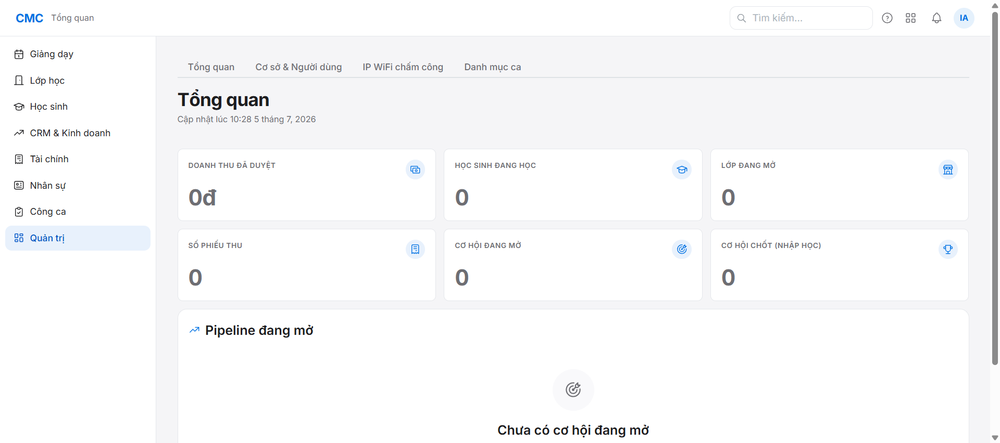

# Chặng 0 — Reset môi trường + Preflight (vai trò: IT)

Mục tiêu: đưa hệ thống về trạng thái sạch sẽ, chuẩn bị cho toàn bộ vòng đời nghiệp vụ chạy từ đầu.

## Bước 1 — Cấu hình `.env` (1 lần, chỉ máy local)

Trong file `.env` ở gốc repo, đảm bảo có các dòng sau (ảnh hưởng CHỈ máy dev local):
```
STAFF_PASSWORD_LOGIN="true"   # cho phép nhân viên thường đăng nhập bằng mật khẩu (mặc định false)
SSO_ENABLED="false"
BREVO_API_KEY=""               # để trống -> email PH sẽ không gửi thật, chỉ ghi vào outbox
BREVO_SENDER_EMAIL=""
```

## Bước 2 — Xoá sạch + dựng lại DB local

```bash
docker compose -f docker/docker-compose.dev.yml down -v   # xoá volume DB cũ
pnpm db:up                                                  # dựng Postgres :5433 + Redis :6380 mới
```

## Bước 3 — Apply migrations + seed tối thiểu

```bash
# export env vào shell trước (Windows: prisma CLI không tự đọc .env khi chạy qua pnpm --filter)
set -a; source .env; set +a

pnpm --filter @cmc/db exec prisma migrate reset --force --skip-seed
# ⚠️ Prisma sẽ chặn lệnh này nếu phát hiện được gọi bởi AI agent — cần xác nhận rõ ràng
# và chỉ chạy trên DB DEV LOCAL, không bao giờ chạy trên DB thật (prod).

cd packages/db
SEED_MODE=bootstrap npx tsx src/seed.ts    # HQ facility + super_admin + 2 giám đốc (SSO-only)
npx tsx src/seed-curriculum.ts              # 9 khoá học (UCREA L1-L3, Bright I.G 6 level) + 60 unit nội dung
```

**Lưu ý Windows**: nếu chạy `pnpm --filter @cmc/db seed:bootstrap` trực tiếp bị lỗi `'SEED_MODE' is not recognized`, đó là do pnpm chạy script qua cmd.exe không hiểu cú pháp `VAR=x cmd` — dùng cách export + gọi `tsx` trực tiếp như trên (xem `reports/bug-log.md` #2).

## Bước 4 — Dựng stack ứng dụng

```bash
pnpm dev   # chạy đồng thời API (:4000), Admin ERP (:5173), LMS Portal (:5175) qua turbo
```

Chờ tới khi cả 3 cổng phản hồi HTTP trước khi qua bước 5.

## Bước 5 — Verify đăng nhập super_admin

1. Mở `http://localhost:5173`
2. Đăng nhập: `admin@cmc.local` / `ChangeMe!123`
3. Kết quả mong đợi: vào trang Tổng quan, mọi chỉ số = 0 (Doanh thu, Học sinh, Lớp, Phiếu thu, Cơ hội) — xác nhận DB sạch.



## Kết quả preflight ghi nhận

| Gate | Trạng thái | Ghi chú |
|---|---|---|
| DB sạch | ✅ | 0 học sinh, 9 khoá học curriculum (UCREA + Bright I.G), super_admin + 2 giám đốc đã seed |
| STAFF_PASSWORD_LOGIN | ✅ đã bật trong `.env` trước khi dựng stack | Xác minh chức năng thật sẽ làm ở Chặng 1 khi tạo nhân viên mới + đăng nhập |
| Email PH (Brevo) | ⚠️ Key trống | Chặng 6 (gửi email PH) sẽ fallback sang kiểm tra bản ghi outbox, KHÔNG gửi email thật |
| Giám đốc (Quản lý) | ✅ Đã có sẵn từ seed: `nhungdt@cmcvn.edu.vn` (GĐ Kinh doanh), `hongltn@cmcvn.edu.vn` (GĐ Đào tạo) — nhưng gắn SSO-only, chưa chắc login password được | Cần verify ở Chặng 1/2 nếu dùng vai Quản lý cho việc tạo lớp |

## Vai trò tiếp theo
Chặng 1 (HR/super_admin): tạo nhân sự — xem `../01-hr-staff/guide.md`.
