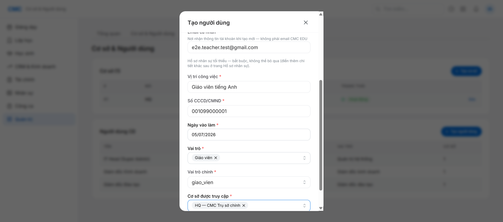
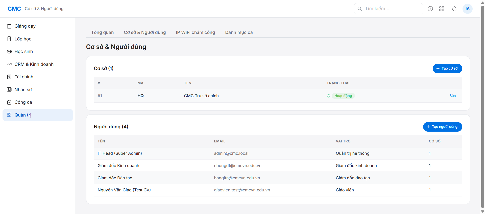
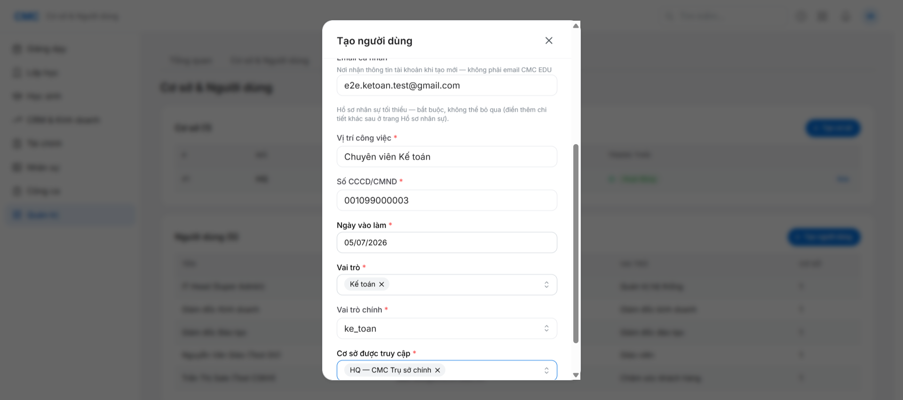
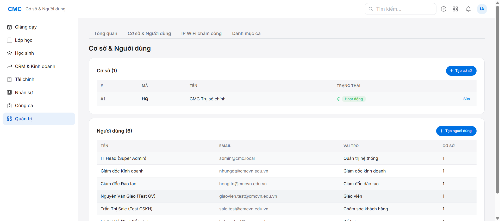
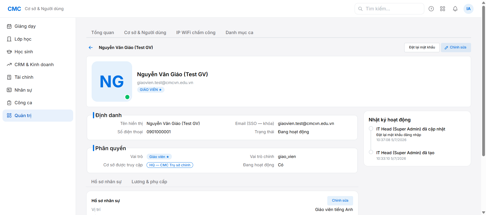
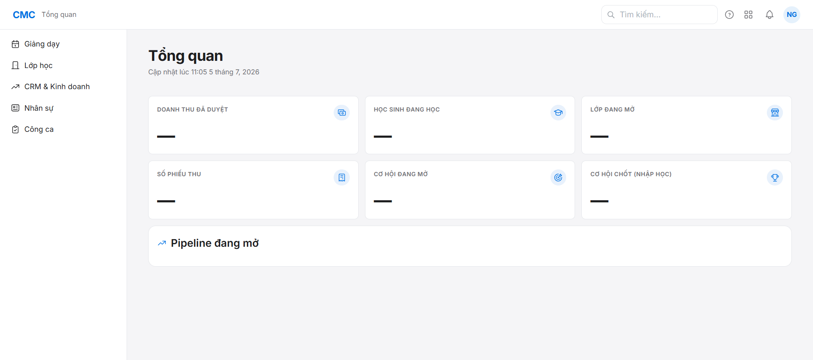
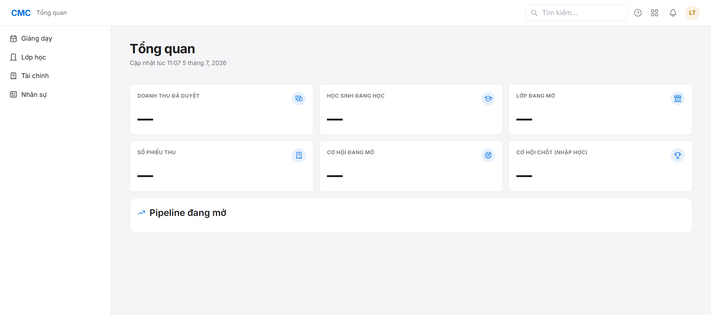

# Chặng 1 — Tạo nhân sự + verify đăng nhập mật khẩu (vai trò: IT/super_admin, sau đó từng nhân sự)

Mục tiêu: tạo giáo viên, sale/CSKH, kế toán; xác nhận mỗi người đăng nhập được bằng mật khẩu (không phải SSO).

## Bối cảnh quan trọng

Form "Tạo người dùng" ghi rõ: **"Nhân sự đăng nhập bằng tài khoản CMC EDU (SSO Microsoft) — không cần đặt mật khẩu."** — nghĩa là mặc định nhân sự dùng SSO. Mật khẩu là một **hành động riêng, làm SAU khi tạo**, ở trang hồ sơ chi tiết nhân sự (nút "Đặt lại mật khẩu"). Đây là tính năng song song với SSO (quyết định 0031), không thay thế.

## Bước 1 — Tạo nhân sự (super_admin: `Quản trị` → `Cơ sở & Người dùng`)

Bấm "Tạo người dùng", điền:
- **Email công ty** (dùng SSO, dạng `...@cmcvn.edu.vn`)
- **Tên hiển thị**
- **Số điện thoại**
- **Email cá nhân** (bắt buộc — nơi nhận thông tin tài khoản khi email công ty chưa dùng được)
- **Vị trí công việc, Số CCCD/CMND, Ngày vào làm** (hồ sơ nhân sự tối thiểu — bắt buộc)
- **Vai trò** (multi-select) + **Vai trò chính** (single) + **Cơ sở được truy cập**

Lặp lại cho 3 vai trò: Giáo viên, Chăm sóc khách hàng (CSKH), Kế toán.

## Bước 2 — Đặt mật khẩu (bắt buộc để login password)

Click vào tên nhân sự trong danh sách → trang hồ sơ chi tiết → nút **"Đặt lại mật khẩu"** (góc trên bên phải).

Hệ thống hiện mật khẩu **CHỈ MỘT LẦN** trong 1 dialog — phải copy/ghi lại ngay, không lưu lại ở đâu khác trong hệ thống. Gửi mật khẩu này cho nhân sự qua kênh an toàn (ngoài hệ thống).

## Bước 3 — Verify đăng nhập bằng mật khẩu

Đăng xuất super_admin → tại màn hình login `http://localhost:5173`, nhập email công ty của nhân sự + mật khẩu vừa đặt → **Đăng nhập** (KHÔNG dùng nút "Đăng nhập bằng tài khoản Microsoft").

Kết quả mong đợi: vào được dashboard, menu điều hướng thu hẹp đúng theo vai trò (vd Giáo viên/CSKH không thấy "Tài chính"/"Quản trị"; Kế toán thấy "Tài chính" nhưng không thấy "CRM & Kinh doanh").

## Lưu ý / bug nhỏ ghi nhận

- Widget "Tổng quan" trên dashboard báo lỗi **"Không tải được tổng quan — Bạn không có quyền thực hiện thao tác này"** khi login bằng Giáo viên hoặc CSKH (không xảy ra với Kế toán/super_admin). Đây là bug nhỏ về phân quyền cho widget, không chặn luồng — đã ghi vào `reports/bug-log.md`.
- Nếu API bất ngờ không phản hồi (treo), xem `reports/bug-log.md` mục #4 — restart `pnpm dev` là cách xử lý tạm.

## Vai trò tiếp theo
Chặng 2 (Quản lý): tạo lớp học — xem `../02-class-create/guide.md`.
