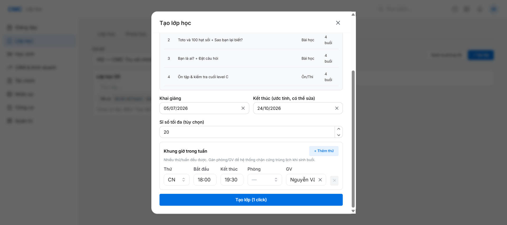
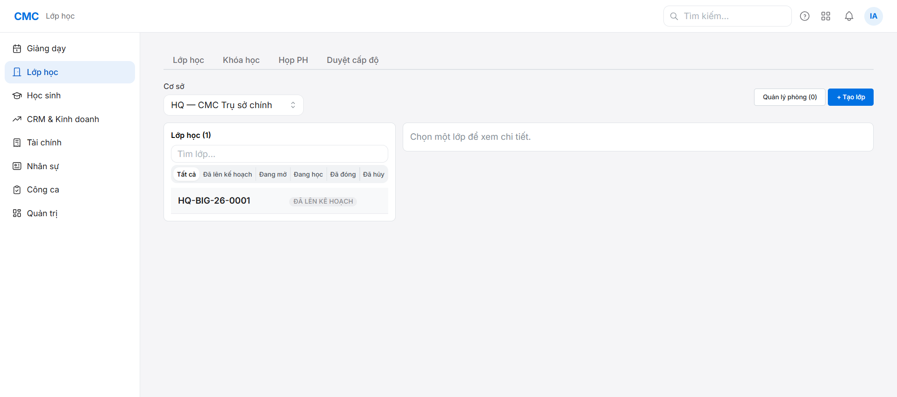

# Chặng 2 — Tạo lớp học (vai trò: Quản lý / super_admin)

Mục tiêu: tạo 1 lớp gắn khung chương trình cứng (curriculum), có lịch tuần + GV, mã lớp tự sinh.

## Bối cảnh

Vào **Lớp học** (super_admin đứng vai Quản lý — 2 giám đốc mặc định chỉ SSO, chưa đặt mật khẩu trong phiên này). Bấm "+ Tạo lớp".

## Các trường cần điền

1. **Khung chương trình (khóa cứng)** — chọn 1 level cụ thể (vd `BRIGHT_IG-C — Bright I.G — Level C`). Hệ thống hiện ngay khung 4 unit / 16 buổi đã soạn sẵn nội dung — không tự soạn giáo án ở bước này.
2. **Khai giảng / Kết thúc** — nhập ngày khai giảng, ngày kết thúc **tự động ước tính** theo 16 buổi (có thể sửa tay).
3. **Sĩ số tối đa** — tùy chọn.
4. **Khung giờ trong tuần** — chọn Thứ + giờ bắt đầu/kết thúc; **Phòng** (nếu đã tạo phòng) + **GV** (bắt buộc chọn để tránh trùng lịch khi sinh buổi sau).
5. Bấm **"Tạo lớp (1 click)"** — mã lớp tự sinh, không cần nhập tay.

## Kết quả

- Mã lớp tự sinh: `HQ-BIG-26-0001` — đúng định dạng `[Cơ sở]-[Chương trình]-[Năm]-[STT]`.
- Trạng thái: "ĐÃ LÊN KẾ HOẠCH" (chưa có buổi học nào — xem chặng 3).

## Lưu ý

- **Không có phòng nào được tạo sẵn** trong DB mới (0 phòng) — nếu muốn hệ thống chặn trùng lịch theo phòng, cần vào "Quản lý phòng" tạo phòng trước. Bỏ qua ở phiên này (chỉ gán GV).
- Chọn **Thứ = CN (Chủ Nhật)** vì hôm nay (5/7/2026) là Chủ Nhật — để buổi học đầu tiên rơi đúng hôm nay, phục vụ chặng điểm danh/đánh giá sau (chặng 8). Nếu chạy vào ngày khác, chọn thứ tương ứng ngày hôm đó.

## Vai trò tiếp theo
Chặng 3 (Quản lý): sinh lịch buổi học — xem `../03-generate-sessions/guide.md`.
