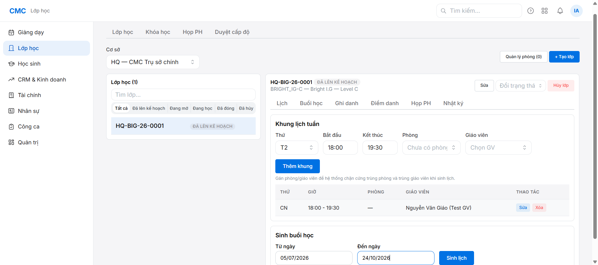
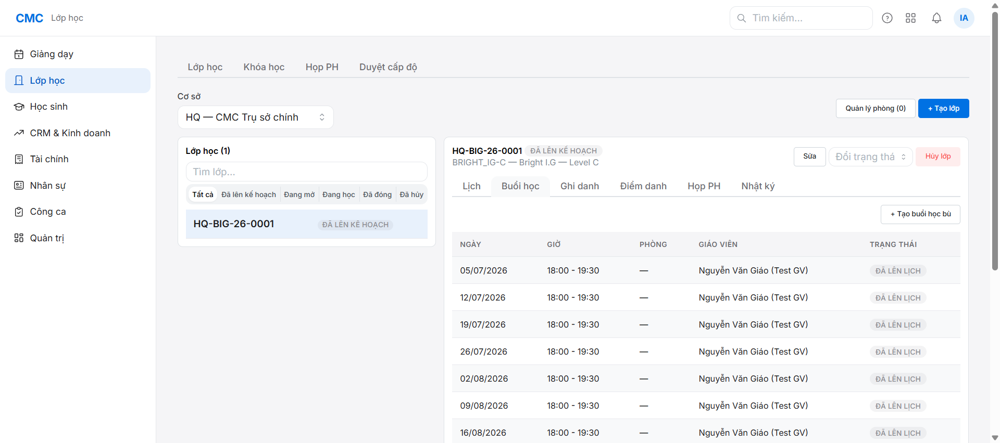

# Chặng 3 — Sinh buổi học (vai trò: Quản lý)

Mục tiêu: từ khung lịch tuần đã gán ở chặng 2, sinh ra các buổi học cụ thể (ClassSession) để sau này điểm danh/nhận xét.

## Bối cảnh

Đây vẫn là bước **bấm tay riêng** (chưa tự động sau khi tạo lớp) — xem `plans/reports/brainstorm-260705-0944-...` để biết đề xuất tự động hoá trong tương lai (chưa làm ở phiên này, ngoài phạm vi).

## Bước 1 — Vào tab "Lịch" của lớp

Trong chi tiết lớp (`HQ-BIG-26-0001`), tab "Lịch" đã hiện khung tuần đã gán (CN, 18:00-19:30, GV = Nguyễn Văn Giáo). Cuộn xuống mục "Sinh buổi học".

## Bước 2 — Điền khoảng ngày + Sinh lịch

Điền "Từ ngày" / "Đến ngày" (khớp khoảng khai giảng-kết thúc của lớp), bấm **"Sinh lịch"**.

## Kết quả

Hệ thống sinh đúng 16 buổi (khớp khung khóa cứng 16 buổi của Bright I.G Level C), buổi đầu tiên đúng ngày khai giảng (05/07/2026, hôm nay).

## Bug nhỏ ghi nhận

Ngay sau khi bấm "Sinh lịch" thành công, tab **"Buổi học"** hiển thị **"Chưa có buổi học"** — SAI, vì DB đã có đủ 16 dòng (verify bằng `psql`). Đây là lỗi cache phía UI (React Query không tự làm mới sau mutation), **F5 lại trang là thấy đúng ngay**. Không mất dữ liệu, chỉ là hiển thị chưa cập nhật kịp — đã ghi vào `reports/bug-log.md` #8.

## Vai trò tiếp theo
Chặng 4 (Sale/CSKH): CRM O1→O5 — xem `../04-crm-o1-o5/guide.md`.
