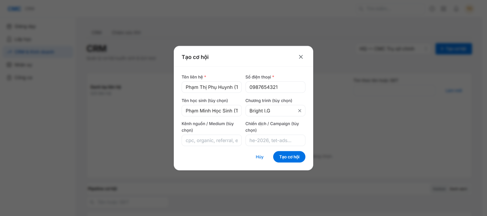
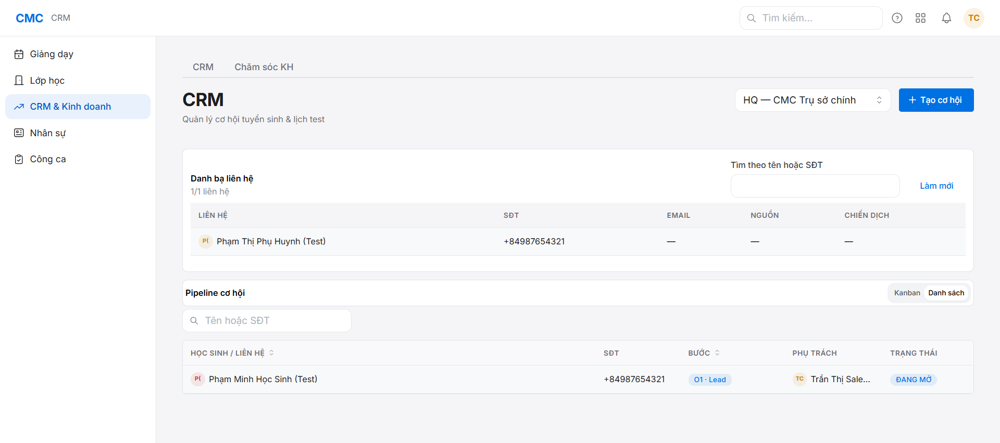
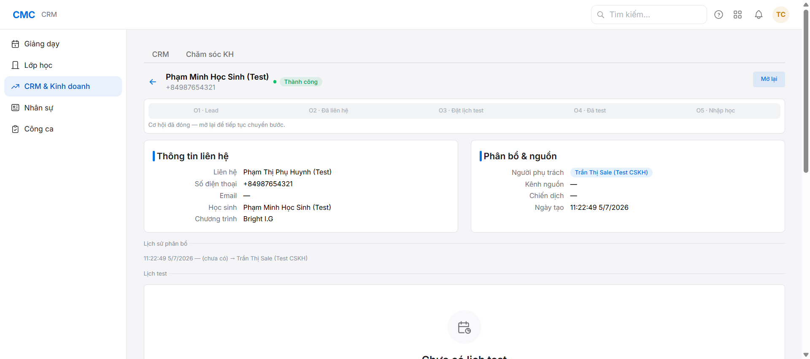

# Chặng 4 — CRM: Lead O1 → O5 "Nhập học" (vai trò: Sale/CSKH)

Mục tiêu: chạy pipeline tuyển sinh từ Lead tới "Nhập học" (O5), và hiểu rõ vì sao **chưa có học sinh** trong hệ thống ở bước này.

## Bước 1 — Tạo cơ hội (CRM & Kinh doanh → CRM → "Tạo cơ hội")

Form chỉ có: **Tên liên hệ** (phụ huynh), **Số điện thoại**, **Tên học sinh** (tùy chọn), **Chương trình** (tùy chọn), Kênh nguồn/Chiến dịch (tùy chọn). **Không có field email phụ huynh** ở đây — email sẽ nhập ở bước tạo Phiếu thu (chặng 5).

## Bước 2 — Chuyển bước O1 → O2 → O3 → O4 → O5

Vào chi tiết cơ hội, các nút O1-O5 hiện ngay trên đầu trang — bấm tuần tự từng bước (O2 "Đã liên hệ" → O3 "Đặt lịch test" → O4 "Đã test" → O5 "Nhập học"). Mỗi lần chuyển bước ghi log ở "Nhật ký & ghi chú" phía dưới.

## Bước 3 — Tại O5: XÁC NHẬN CHƯA CÓ HỌC SINH (đúng thiết kế)

**Đây là điểm hay bị hiểu nhầm là lỗi** — verify bằng SQL: `SELECT count(*) FROM student;` → vẫn = 0 sau khi cơ hội đạt O5.

Lý do (quyết định 0033, đã brainstorm kỹ ở `plans/reports/brainstorm-260705-1006-...`): **Học sinh CHỈ được tạo khi Kế toán duyệt Phiếu thu** (atomic: Student + tài khoản PH + Ghi danh + tài khoản LMS cùng lúc). CRM thắng deal (O5) là tín hiệu kinh doanh, KHÔNG tự động tạo hồ sơ tài chính/học vụ — đây là ranh giới cố ý giữa Sale và Kế toán, không phải bug.

**Bước tiếp theo bắt buộc**: Sale phải chủ động tạo Phiếu thu (chặng 5) — hệ thống hiện KHÔNG tự động điền lại thông tin từ Opportunity sang Receipt (phải gõ tay lại tên HS/SĐT/chương trình) — đây là điểm cải tiến đã đề xuất nhưng ngoài phạm vi phiên này.

## Vai trò tiếp theo
Chặng 5 (Sale tạo phiếu thu → Kế toán duyệt): xem `../05-receipt-approve/guide.md`.
