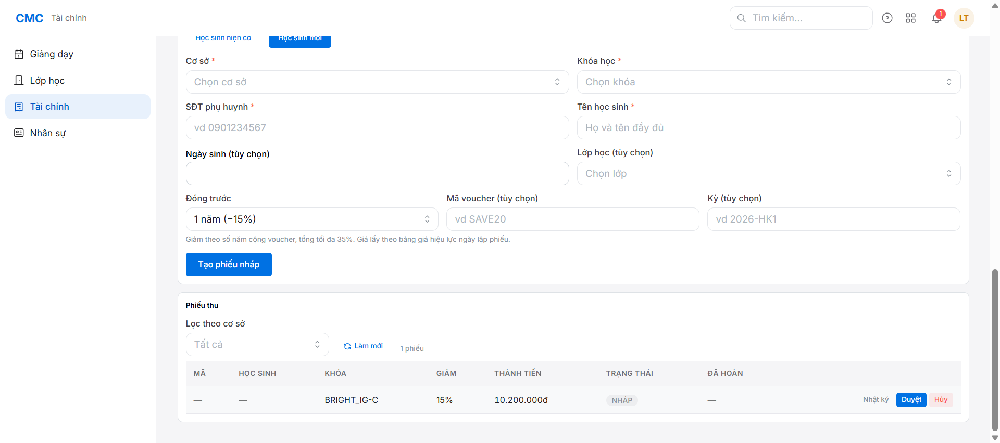
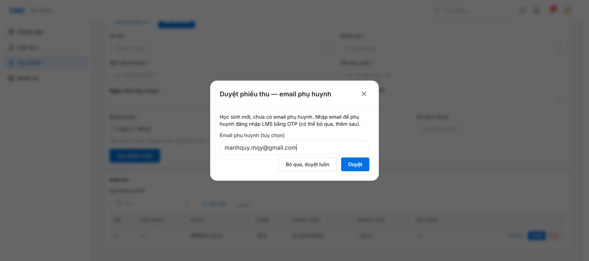
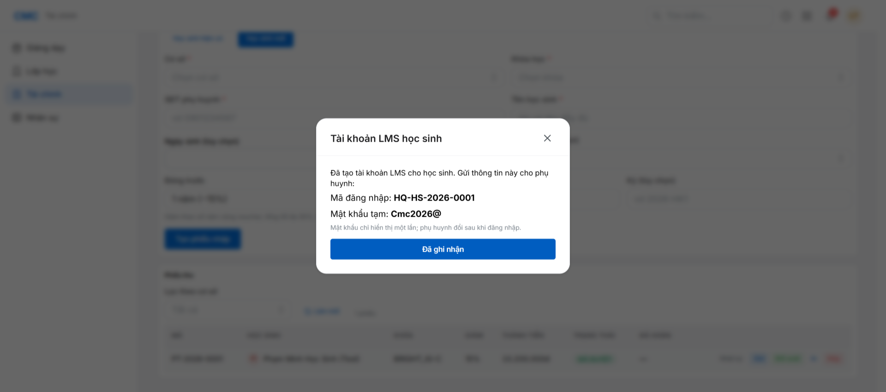

# Chặng 5 — Lập phiếu thu (Sale/Kế toán) + Duyệt (Kế toán) → Học sinh xuất hiện

Mục tiêu: đây là **khoảnh khắc học sinh thật sự xuất hiện trong hệ thống** — atomic: Student + tài khoản PH + Ghi danh + tài khoản LMS.

## Bối cảnh quan trọng

- Module "Tài chính" **chỉ Kế toán/Giám đốc kinh doanh nhìn thấy** (Sale/CSKH KHÔNG có mục này trong nav — khác giả định ban đầu "Sale tạo phiếu thu", thực tế kế toán làm cả 2 bước tạo + duyệt).
- Trước khi lập phiếu, phải có **bảng giá khóa học** cho chương trình đó (mục "Bảng giá khóa học" phía trên, tạo giá theo Cơ sở + Khóa học + ngày hiệu lực).

## Bước 1 — Lập phiếu thu (mục "Lập phiếu thu")

Chọn "Học sinh mới" → điền: Cơ sở, Khóa học, **SĐT phụ huynh**, **Tên học sinh** (khớp thông tin CRM), Lớp học (tùy chọn — chọn đúng lớp đã tạo ở chặng 2 để tự động Ghi danh). **Không có field email PH ở đây.**

Bấm "Tạo phiếu nháp".



## Bước 2 — Duyệt (đây là nơi nhập email PH)

Bấm "Duyệt" trên phiếu nháp → dialog **"Duyệt phiếu thu — email phụ huynh"** hiện ra CHỈ KHI học sinh mới chưa có email. Điền email PH ở đây (tùy chọn, có thể bỏ qua).



## Kết quả: atomic provisioning

Ngay khi bấm Duyệt: Student + ParentAccount + Enrollment (nếu có lớp) + StudentAccount (tài khoản LMS) được tạo cùng lúc trong 1 transaction. Dialog hiện **mã đăng nhập + mật khẩu tạm LMS** — chỉ hiện 1 lần, ghi lại ngay.



Verify SQL:
```sql
SELECT student_code, full_name, lifecycle FROM student;         -- active, có createdByReceiptId
SELECT phone, email FROM parent_account;                          -- email = email vừa nhập
SELECT class_batch_id, status FROM enrollment;                    -- active, đúng lớp
SELECT login_code FROM student_account;                           -- mã đăng nhập LMS
```

## Bug thật tìm thấy + đã sửa

Lúc verify email outbox cho phụ huynh, phát hiện **`email_outbox` KHÔNG có dòng nào** dù `ParentAccount.email` đã set đúng. Đọc code `finance.ts` `receiptApprove`: cả 2 chỗ (propagate email vào ParentAccount, và check gửi email chào mừng LMS) chỉ đọc cột `receipt.parentEmail` (rỗng, vì phiếu tạo không có field này) thay vì email vừa nhập lúc Duyệt (`input.parentEmail`). Kết quả: **PH không bao giờ nhận được email chào mừng LMS** khi email được nhập ở bước Duyệt — đúng ngay luồng mà dialog này được thiết kế ra để phục vụ.

Đã sửa: cả 2 chỗ giờ dùng `input.parentEmail ?? receipt.parentEmail` (khớp pattern đã có sẵn ở chỗ tạo ParentAccount mới). Verify: `tsc` sạch, 23 integration test liên quan pass (bao gồm test tên "receipt approval ... queues the parent email"). Commit `5a225a6`.

## Vai trò tiếp theo
Chặng 6: kiểm tra email PH (thật hoặc outbox) — xem `../06-parent-email/guide.md`.
