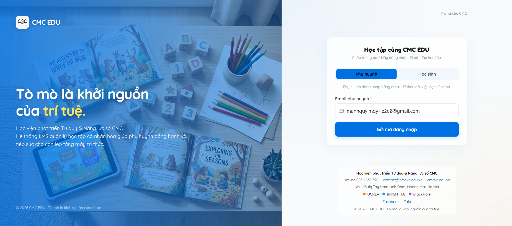
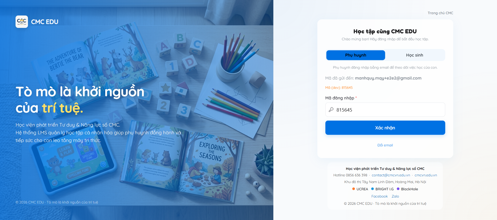
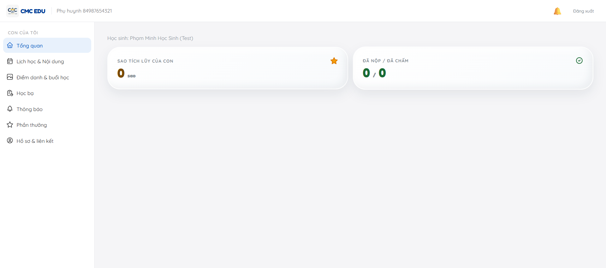
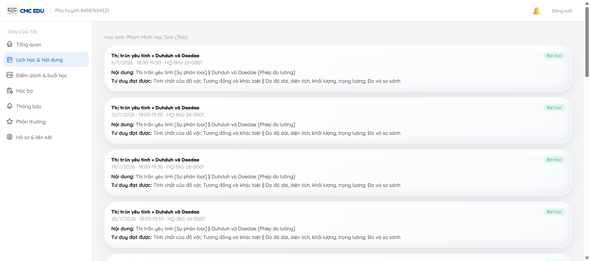

# Chặng 7 — Phụ huynh đăng nhập cổng học LMS

Mục tiêu: PH dùng thông tin đã có (email, mã đăng nhập gửi lúc duyệt phiếu) để vào cổng học `http://localhost:5175`.

## Lưu ý khác với dự tính ban đầu

Kế hoạch ban đầu giả định luồng đăng nhập PH là "Netflix-profile" bằng SĐT. Thực tế UI hiện tại (`http://localhost:5175`) yêu cầu **email phụ huynh trước, xác nhận bằng mã OTP** — không nhập SĐT trực tiếp. Ở môi trường dev, mã OTP **hiện luôn trên UI** (dòng "Mã (dev): ...") — không cần vào hộp thư thật.

## Bước 1 — Nhập email PH

## Bước 2 — Nhập mã OTP (dev mode tự hiện + tự điền)

Bấm "Xác nhận" → vào thẳng cổng học, không cần chọn hồ sơ con (khác giả định "Netflix profile picker" — có thể vì gia đình test này chỉ có 1 con).

## Kết quả

## Lưu ý vận hành

- Test lần đầu vô tình đăng nhập nhầm email của 1 phụ huynh khác (học sinh tạo lúc verify bug, chưa ghi danh lớp) — dùng "Đổi email" để quay lại và nhập đúng email PH cần kiểm tra.
- PH thấy đúng lớp `HQ-BIG-26-0001`, đủ 16 buổi, kèm nội dung bài học (tên unit, tư duy đạt được) lấy trực tiếp từ khung chương trình — không cần giáo viên nhập tay giáo án.

## Vai trò tiếp theo
Chặng 8 (Giáo viên): điểm danh, nhận xét, upload ảnh buổi học — xem `../08-teaching-day/guide.md`.
