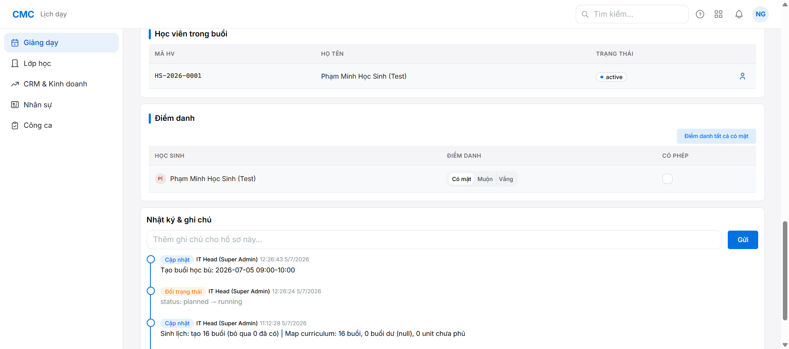
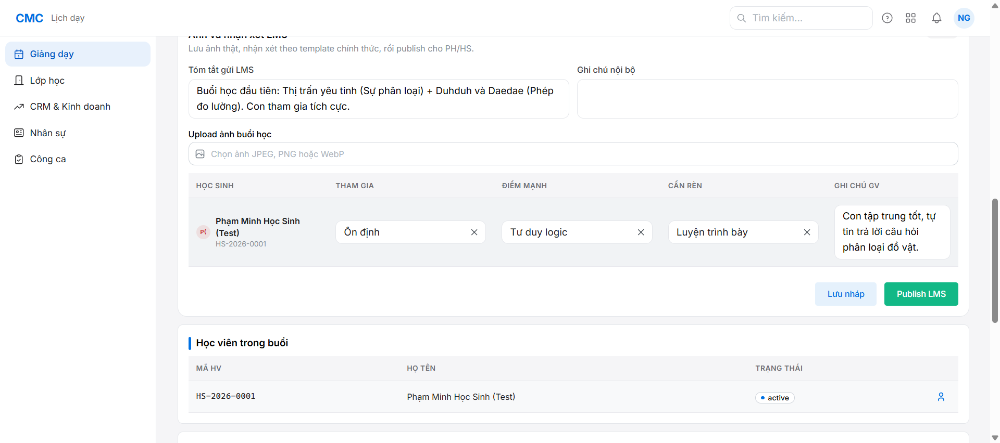
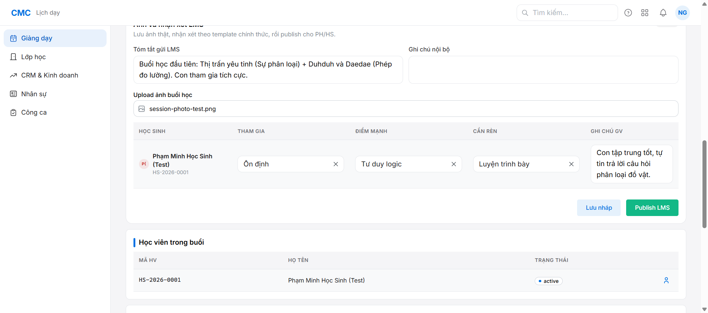
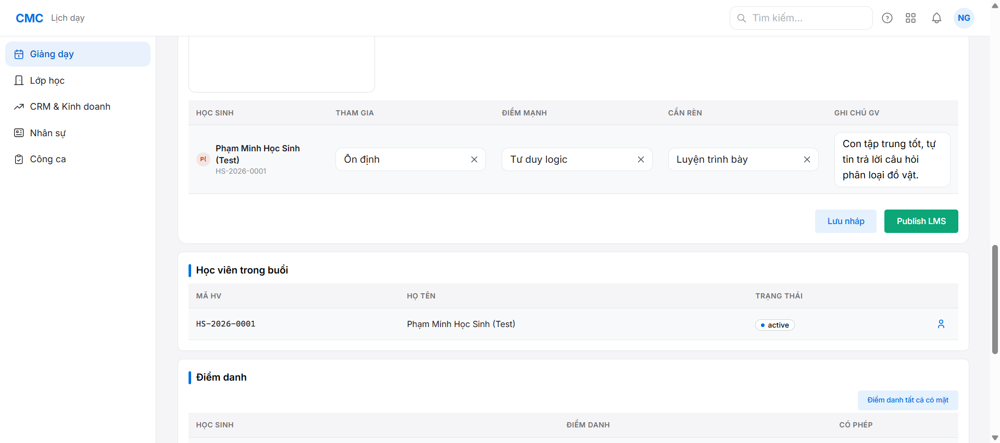
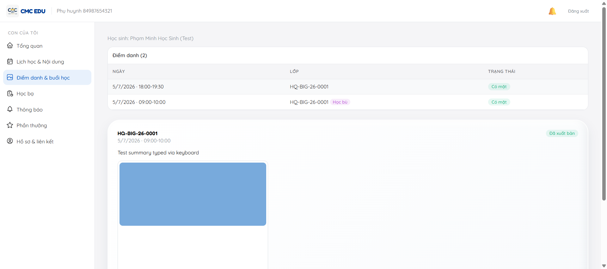

# Chặng 8 — Ngày dạy: điểm danh, nhận xét, ảnh lớp (Giáo viên)

Mục tiêu: giáo viên hoàn tất "Quy trình buổi học 360" cho 1 buổi — điểm danh → nhận xét từng học sinh → upload ảnh → publish lên LMS cho PH xem.

## Lưu ý quan trọng: gate theo giờ thật

Buổi học chính (18:00-19:30 hôm nay) chưa tới giờ lúc test (giữa trưa) → mục "Ảnh & nhận xét LMS" hiện **"Chưa mở — Mở sau giờ kết thúc buổi học"**, không thể nhập/upload gì (đây là thiết kế đúng, không phải bug). Để kiểm thử đầy đủ luồng ngay trong phiên, dùng tính năng có sẵn **"+ Tạo buổi học bù"** (super_admin) tạo 1 buổi bù 09:00-10:00 cùng ngày (khung giờ đã qua) — buổi bù có giờ kết thúc trong quá khứ nên mở khóa "post_class" ngay, không cần chờ hay chỉnh giờ hệ thống.

Lưu ý phụ: buổi bù cần (a) lớp ở trạng thái "Đang mở"/"Đang học" (không phải "Đã lên kế hoạch"), (b) gán giáo viên — 2 điều kiện này phải set trước khi buổi bù xuất hiện trong "Lịch dạy" của GV.

## Bước 1 — Điểm danh

Vào Lịch dạy → chọn buổi 09:00-10:00 → "Vẫn điểm danh" (bypass cảnh báo giờ) hoặc "Điểm danh tất cả có mặt".



## Bước 2 — Nhận xét từng học sinh

Panel "Ảnh và nhận xét LMS": chọn Tham gia / Điểm mạnh / Cần rèn theo template có sẵn (dropdown, không tự gõ) + Ghi chú GV tự do.



## Bước 3 — Upload ảnh buổi học

Chọn file JPEG/PNG/WebP — ảnh lưu ngay khi chọn (không cần đợi Publish).



## Bước 4 — Publish LMS

Bấm "Publish LMS" → cần có Tóm tắt gửi LMS (bắt buộc) → trạng thái chuyển "NHÁP" → "ĐÃ PUBLISH".



Verify SQL:
```sql
SELECT status, summary, published_at FROM session_evidence WHERE class_session_id = '<id>';
SELECT participation, strength, needs_improvement FROM session_student_comment;
SELECT photo_ref FROM session_evidence_photo;
```

## Bước 5 — PH xem kết quả (bằng chứng acceptance cuối)

Cổng LMS PH (`http://localhost:5175`) → "Điểm danh & buổi học": thấy cả 2 buổi (chính + bù, cả 2 "Có mặt"), card buổi bù có tag "Học bù", "Đã xuất bản", tóm tắt, Tham gia/Điểm mạnh/Cần rèn, ghi chú GV, và **ảnh** — đây là bằng chứng khép kín toàn bộ chuỗi nghiệp vụ từ tạo nhân sự → lớp → CRM → thu tiền → ghi danh → dạy → PH xem.



## Lưu ý kỹ thuật (không phải bug sản phẩm)

Khi test bằng browser automation, tool `fill`/`fill_form` set giá trị ô "Tóm tắt gửi LMS" (Mantine Textarea) không kích hoạt đúng state React — hiện đúng trên UI nhưng publish gửi giá trị rỗng lên server. Gõ phím thật (`type_text`) khắc phục ngay. Ghi chú lại trong `reports/bug-log.md` để tránh hiểu nhầm là bug ứng dụng ở phiên sau.

## Kết thúc E2E walkthrough
Toàn bộ 8 chặng (Nhân sự → Lớp học → Sinh lịch → CRM → Phiếu thu → Email PH → Đăng nhập LMS → Ngày dạy) đã chạy qua thực tế, tìm + sửa 1 bug thật (email PH khi duyệt phiếu), phát hiện 1 gap edge-case (email trùng), và xác nhận toàn chuỗi nghiệp vụ hoạt động đúng thiết kế.
