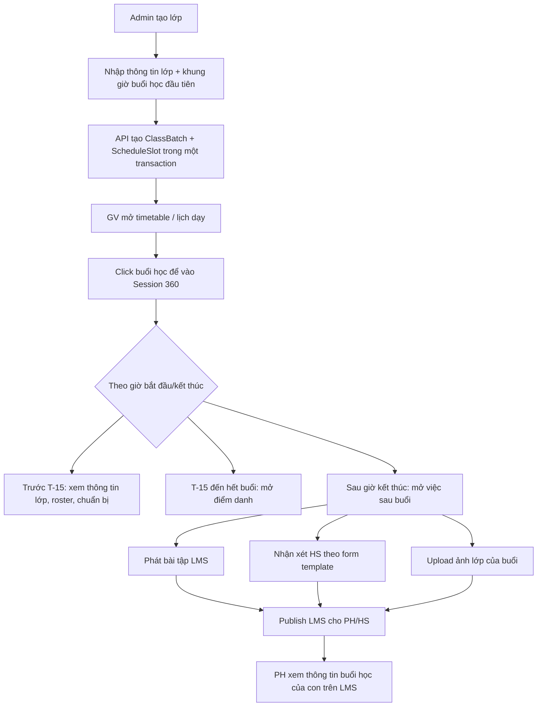

# Session 360 + /grading session evidence

Status: approved-for-vertical-slice
Lane: high-risk
Intake: #42
Story: `docs/stories/LMS-SESSION-EVIDENCE/`

## Codebase Context

- Stack: pnpm monorepo, React + Mantine admin/LMS, Hono + tRPC API, Prisma/Postgres, RLS via `withRls`.
- `/grading` lives in `apps/admin/src/grading.tsx`; file already >200 LOC, so implementation should split session/comment sub-panels before adding more UI.
- Existing LMS surfaces are in `apps/lms/src/student-view.tsx`; PH/HS already see exercises, results, gradebook, badges, rewards, courses.
- Current learning-session data is `ClassSession` + `Attendance`; no session photo/log/comment table yet.
- Existing upload path is PDF-only: `POST /upload/exercise-pdf` + guarded `GET /files/exercise/:ref`.
- Security pattern: parent/student visibility must be enforced server-side through `lmsProcedure` + RLS, not only UI filters.

## Expected Output

1. Class creation becomes less fragmented:
   - user can set first weekly lesson day/time while creating a class,
   - API creates the class and first `ScheduleSlot` in one transaction,
   - existing Schedule tab remains available for more weekly slots and session generation.
2. Staff schedule/session detail becomes the main workflow:
   - timetable row opens a Session 360 view,
   - before class: session info/roster visible,
   - T-15 minutes through end time: attendance is available,
   - after end time: post-class tasks are shown automatically.
3. Post-class task cards mock the future workflow:
   - publish homework to LMS,
   - teacher comment form template (no approval required),
   - whole-class session photo upload placeholder,
   - LMS publish checklist.
4. Later full LMS evidence slice keeps:
   - shows only sessions for owned/enrolled student,
   - shows published photos,
   - shows class/session summary,
   - shows only that student's personal comment.
5. Review artifact includes business flow and an interactive static prototype:
   - `plans/20260630-1610-grading-session-evidence/session-evidence-flow.md`
   - `plans/20260630-1610-grading-session-evidence/prototype.html`

## Acceptance Criteria

- Creating a class can optionally create the first weekly schedule slot with day/start/end/room/teacher.
- Invalid initial slot times are rejected by the same server rules as `schedule.addSlot`.
- Existing class creation without slot data remains backward-compatible.
- Session detail shows automatic phase from schedule time: before class, attendance window, after-class workflow.
- Attendance remains the real existing component; homework/comment/photo/LMS publish cards are clearly mock placeholders this round.
- Existing exercise grading, PDF annotation, grade publishing, attendance, and gradebook behavior remain unchanged.

## Scope Boundary

In scope:

- Extend `classBatch.create` with optional `initialSlot`.
- Enhance class creation UI to capture first lesson time.
- Enhance `ScheduleDetailPanel` with Session 360 workflow cards.
- Update prototype/docs to show the timetable-centered workflow.

Out of scope this round:

- Persisted session evidence/photo/comment models.
- LMS-visible session evidence API/UI.
- Push notification to PH after publish.
- Cloud object storage provider.
- Photo face blurring/moderation.
- Mobile app native implementation.
- Replacing existing exercise/grade business logic.

## Touchpoints

- `packages/db/prisma/schema.prisma`
- `packages/db/prisma/migrations/*`
- `packages/auth/src/permissions.ts`
- `apps/api/src/index.ts`
- `apps/api/src/routers/index.ts`
- `apps/api/src/routers/class-batch.ts`
- `apps/admin/src/class-workspace.tsx`
- `apps/admin/src/schedule-detail.tsx`
- `apps/api/test/*class-batch*.int.test.ts`

## Implementation Phases

1. API + class setup
   - Add optional `initialSlot` to `classBatch.create`.
   - Create class and first schedule slot atomically.
2. Admin class creation UI
   - Add first lesson day/start/end/room/teacher fields.
   - Show concise explanation that extra weekly slots stay in the Schedule tab.
3. Session 360 detail
   - Add time-derived workflow status and post-class mock task cards.
   - Keep `AttendanceRoster` as the real attendance surface.
4. Validation
   - Typecheck API/admin.
   - Add/update focused integration where practical.

## Business Flow

## Open Questions

1. Persisted LMS session evidence remains next phase after this UI/API slice.
2. Comment templates will be supplied later; this slice mocks the template form.
3. No head_teacher approval required for template comments per user decision.
