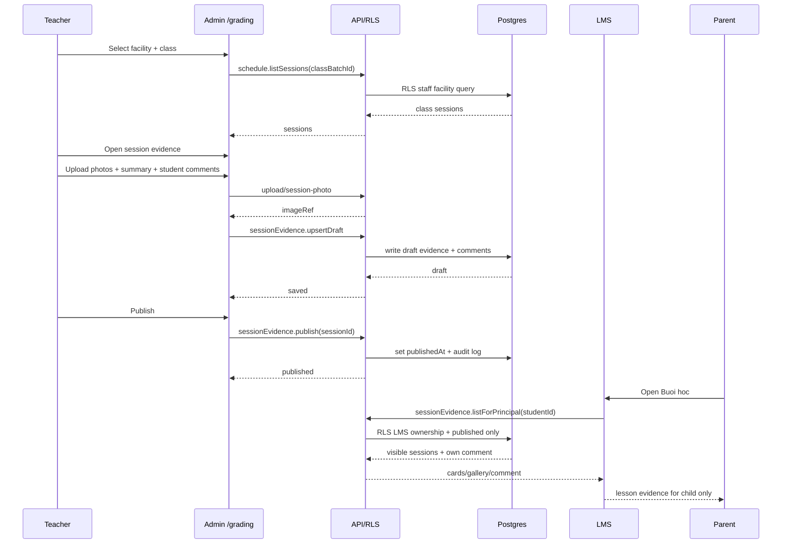
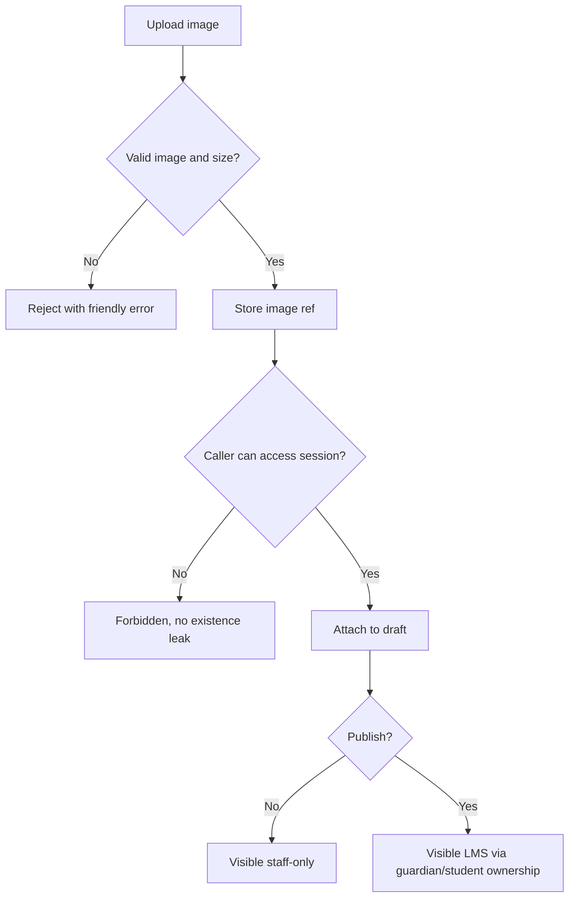

# Business Flow: /grading session evidence

## Roles

- GV: uploads photos, writes class/session/student comments, publishes.
- Head teacher / Quan ly: can review or edit depending permission.
- PH/HS: reads published session information in LMS, scoped to owned student.

## Happy Path

## UX Target

- One class screen, not separate teacher chores.
- Teacher works in this order: choose session, attach evidence, comment students, publish.
- Draft save is automatic/cheap; publish is explicit.
- LMS view reads like a learning diary, not a grading table.

## Failure / Guard Flow

## Optimization Notes

- Default to today's/nearest session after class select.
- Inline student comments in a roster table; no modal per student.
- Preserve existing exercise grading tab to avoid retraining.
- Publish checklist should show: photos count, summary present, comments count.
