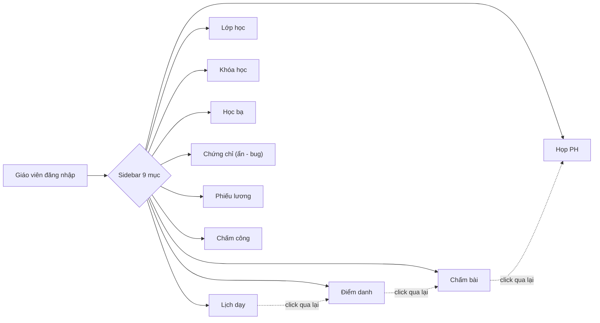
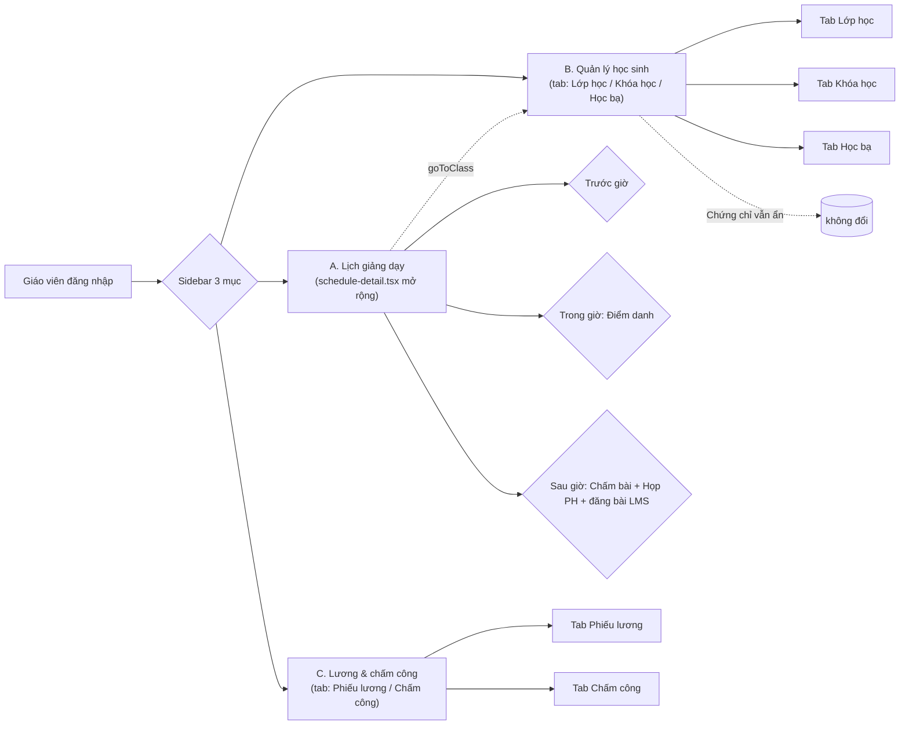
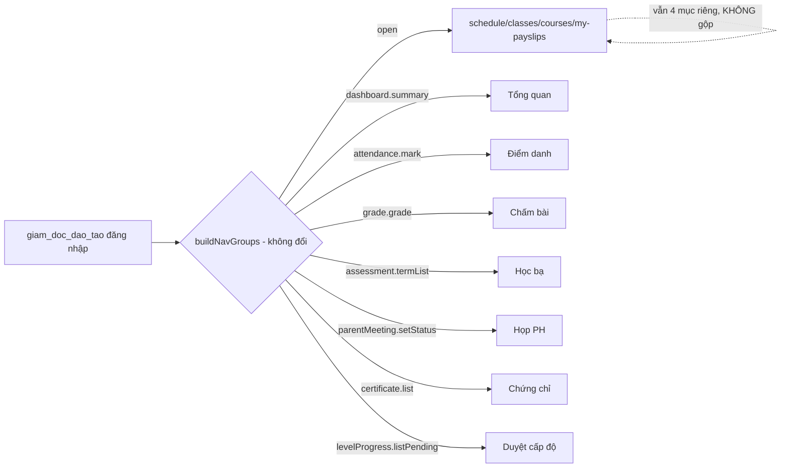
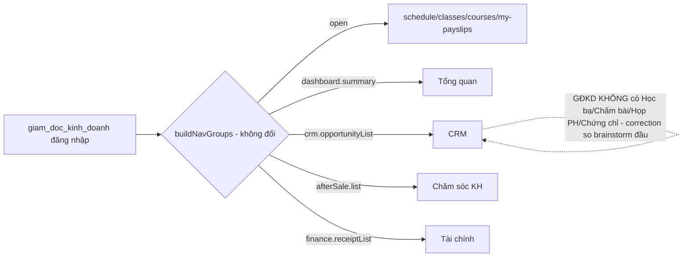

# Plan: Gộp nav Giáo viên theo mẫu Lịch 360

## Trạng thái
- Brainstorm: DONE (PA1 chọn, xem báo cáo nguồn ở trên)
- Nghiên cứu rủi ro vòng 1 (5 agent song song: RBAC, UI convention, test coverage, cross-role sharing, API/data): DONE, không có blocker
- Audit vòng 2 (3 agent song song đối chiếu plan vs code thật): DONE — đã sửa các sai lệch (xem "Sửa sau audit" bên dưới)
- Quyết định đã chốt: không redirect URL cũ / giữ ẩn Chứng chỉ / deep-link goToClass mở trong tab màn gộp
- Quyết định GradingPanel/MeetingsPanel preselect: CHỐT ở phase-04 (thêm prop optional `initialFacilityId`/`initialBatchId`), xem "Sửa sau audit" ở đó.
- **Implementation: DONE (5/5 phase)** — xem "Kết quả implement" bên dưới.
- **Còn lại trước khi coi plan là "done" thật sự**: chạy Playwright spec `teacher-nav-consolidation.spec.ts` trên stack sống (dev server + Postgres) — chưa chạy được trong phiên làm việc này vì không có stack chạy sẵn.

## Kết quả implement (260701-1957, /ck:cook)
- Cả 5 phase code xong, build (`pnpm --filter admin build`) và unit test (`pnpm --filter admin test`, 14/14 own suite) pass.
- **Sai lệch so với phase docs gốc (đã hỏi lại user, được duyệt):** phase-02/03 chỉ nói ẩn `classes`/`courses`/`assessment` và `my-payslips`/`checkin`, nhưng acceptance criteria đòi đúng 3 mục nav — nên đã ẩn thêm `attendance`/`grading`/`meetings` cho tài khoản CHỈ có role `giao_vien` trong `buildNavGroups()` (shell.tsx), vì 3 chức năng này đã nhúng sẵn trong Lịch 360 (AttendanceRoster + 2 WorkflowCard mới ở phase-04).
- **Bổ sung sau code review:** `student-management-panel.tsx`/`payroll-checkin-panel.tsx` ban đầu thiếu per-tab `can()` gate (acceptance criteria dòng 115 chưa đạt) — đã thêm gate `assessment.termList`/`checkInOut.punch` mirror theo `NAV_GATES` gốc.
- **Chưa làm:** không thêm test component-render (React Testing Library) cho việc ẩn tab theo quyền — repo chưa có hạ tầng test loại này ở bất kỳ đâu; test hiện tại (`nav-teacher-consolidation.test.ts`) chỉ verify ở tầng `buildNavGroups()`, không verify tầng tab bên trong 2 panel mới. Cần quyết định user nếu muốn thêm hạ tầng RTL/jsdom.
- **Playwright spec viết xong nhưng CHƯA chạy** (`apps/e2e/tests/teacher-nav-consolidation.spec.ts`) — không có dev server (localhost:5173) + Postgres (localhost:5433) chạy sẵn trong phiên này.
- **Lưu ý ngoài phạm vi:** phát hiện 1 session khác đang sửa đồng thời `packages/auth/src/permissions.ts` + `App.tsx` (RBAC role consolidation, xóa quan_ly/head_teacher/bgd — xem memory `rbac-role-consolidation-decision`) trong CÙNG working tree không cô lập. Việc này làm 2 test cũ (`nav-consistency.test.ts` D1/D2) fail — KHÔNG liên quan plan này, không sửa.

## Sửa sau audit vòng 2 (đối chiếu code thật)
- Tên quyền chấm bài đúng là `grade.grade`, KHÔNG phải `grading.grade` (đã sửa phase-04).
- `TermsPanel` không nằm trong `Courses()`, giữ nguyên tại `App.tsx` case `'courses'` (đã sửa phase-01).
- Rẽ nhánh ẩn/gộp theo role nằm trong `buildNavGroups()` (đã có sẵn `roles`), không sửa `visible()` (đã sửa phase-02/03).
- `NAV_GATES` là kiểu `Record<SectionKey, NavGate>` — thêm `SectionKey` mới bắt buộc có placeholder gate tương ứng để thỏa TypeScript (đã sửa phase-02/03).
- `nav-consistency.test.ts` hiện tại KHÔNG gọi `buildNavGroups()` — chỉ so `NAV_GATES` với `PERMISSIONS`. Test "giáo viên thấy đúng nav mới" phải là file MỚI gọi thẳng `buildNavGroups()`, không phải sửa `expectedOpen` như bản đầu (đã viết lại phase-05).
- Rủi ro mới: `assessment.termList` cũng cấp cho `head_teacher`/`quan_ly` — rẽ nhánh phải kiểm tra role DUY NHẤT là `giao_vien`, tránh rò rỉ gộp sang 2 role đó khi 1 tài khoản có nhiều role (đã thêm test case trong phase-05).
- Correction giả định cũ: GĐKD (`giam_doc_kinh_doanh`) thực tế KHÔNG có Học bạ/Chấm bài/Họp PH/Điểm danh/Chứng chỉ (chỉ Lớp học/Khóa học qua gate `open` chung mọi role) — bản brainstorm vòng đầu ghi nhầm là GĐKD có các mục này. Không ảnh hưởng plan giáo viên (GĐKD vẫn "không đổi"), nhưng cần sửa lại giả định này khi brainstorm vòng sau cho GĐKD.

## Sơ đồ luồng — TRƯỚC khi gộp (9 mục nav rời rạc)

Vấn đề: 1 buổi dạy = phải nhảy qua 4 trang (A1-A4) không có ngữ cảnh chung; theo dõi học sinh = 4 trang rời (B1-B4); lương/công = 2 trang rời.

## Sơ đồ luồng — SAU khi gộp (3 nhóm theo Lịch 360)

Kết quả: 1 buổi dạy = 1 màn hình đổi theo giờ; theo dõi học sinh = 1 màn 3 tab; lương/công = 1 màn 2 tab. Component gốc (Workspace, Courses, AssessmentPanel, GradingPanel, MeetingsPanel, PayrollPanel, CheckInPanel) không đổi — chỉ bọc thêm lớp điều hướng mới.

## Sơ đồ xác nhận: GĐĐT và GĐKD KHÔNG đổi (đo trực tiếp từ `permissions.ts`/`nav-permissions.ts`)

## Phases

1. `phase-01-extract-courses-component.md` — tách `Courses()` khỏi `App.tsx` thành file riêng (tiền đề bắt buộc, không có file riêng thì không nhét vào tab được)
2. `phase-02-student-mgmt-tab-screen.md` — màn "Quản lý học sinh" (Lớp học+Khóa học+Học bạ tabs), route/SectionKey mới, ẩn 3 mục nav gốc chỉ cho giao_vien, sửa `goToClass` mở trong tab
3. `phase-03-payroll-checkin-tab-screen.md` — màn "Lương & chấm công" (Phiếu lương+Chấm công tabs)
4. `phase-04-schedule-360-extend.md` — thêm 2 `WorkflowCard` (Chấm bài, Họp PH) vào `SessionWorkflowPanel` trong `schedule-detail.tsx`
5. `phase-05-tests.md` — thêm file test mới gọi thẳng `buildNavGroups()` (không sửa `nav-consistency.test.ts` cũ), thêm 1 Playwright spec teacher-nav

## Non-goals (ngoài phạm vi vòng này)
- Không đổi nav 5 vai trò còn lại (sale, GĐKD, GĐĐT, học sinh, phụ huynh) — brainstorm riêng vòng sau.
- Không bật lại "Chứng chỉ" (giữ ẩn theo quyết định).
- Không thêm redirect cho URL cũ.
- Không đổi bất kỳ permission key/API contract nào.

## Acceptance criteria
- Giáo viên đăng nhập thấy đúng 3 mục nav mới thay vì 9 mục cũ.
- GĐĐT/GĐKD đăng nhập: nav không đổi 1 pixel so với hiện tại (test bằng `nav-consistency.test.ts` + Playwright).
- Từng tab trong màn gộp chỉ hiện khi đúng permission (test cho từng permission bị thu hồi).
- `pnpm -w test` (unit) + Playwright teacher-nav spec pass 100%.
- Không sửa `packages/auth/src/permissions.ts`.
