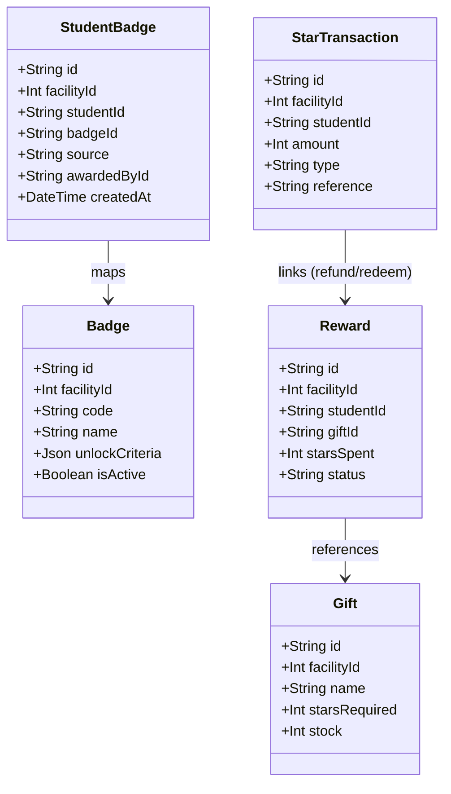

# Feature Comparison: Gamification and Rewards
## Source: odoo/odoo (addons/gamification)
## Local Project: Creative Maieutic Center (cmc_source)

## Head-to-Head
| Aspect | Source | Local | Recommendation |
| --- | --- | --- | --- |
| **Architecture** | Asynchronous, Cron-driven (`ir.cron` running daily/hourly updating `gamification.goal` and awarding badges). | Synchronous, event-driven (triggered immediately on grade publish via `evaluateBadges`). | Maintain real-time evaluation for immediate student feedback; database load is negligible for target classroom sizes. |
| **Star / Karma Tracking** | Point-based updates directly modifying model fields. No native atomic ledger. Prone to synchronization drift. | Strict transactional ledger (`StarTransaction` representing ± adjustments). Balance is computed dynamically as `SUM(amount)`. | Keep the double-entry transaction ledger. It is robust, audit-ready, and prevents cheating or concurrency discrepancies. |
| **Redemption Safety** | Standard Odoo write operations; lacks concurrency locks for stock or point depletion. | PG advisory locks (`pg_advisory_xact_lock` on student ID) and atomic database updates (`updateMany` checking `stock > 0`). | Retain the advisory lock pattern to guarantee double-spend prevention and exact inventory tracking for rewards. |
| **Goal Criteria Evaluation** | Highly abstract. `gamification.goal.definition` queries any database table using model IDs, fields, and domains. | Hardcoded JSON schema parsed in domain code (`stars_total`, `homework_count`). Type-safe but rigid. | Keep the simple JSON approach but standardize the JSON criteria shape to support future criteria (e.g. attendance streaks). |
| **Leaderboard Implementation** | Challenge-scoped persisted rankings computed during cron checks. | Real-time, in-memory computations under a `SYSTEM_RLS` context with strict classmate anonymization. | Maintain the dynamic, privacy-preserving anonymization logic. It is secure, tenancy-compliant, and displays live rankings. |
| **Level Progression** | Auto-calculated ranks based on cumulative points/karma. | Proposal workflow (`LevelProgress` status machine). Teacher proposes, Head Teacher reviews/approves. | Retain proposal-review workflow; manual gatekeeping is pedagogically superior for qualitative student evaluation. |

## Data Model Breakdown
### Odoo Gamification Models (Python/ORM)
1. **`gamification.badge`**: Defines badge metadata, description, and custom limits on manual issuance (`remaining_monthly_sending`).
2. **`gamification.challenge`**: Time-bound missions grouping multiple goals and assigning them to a target cohort (`user_domain`).
3. **`gamification.goal.definition`**: Abstract template defining metric calculations (`computation_mode` = `sum` / `count` / `python`, target table, filters).
4. **`gamification.goal`**: Tracks real-time/cached progress (`current` vs `target_goal`) for an individual user in a specific challenge window.
5. **`gamification.badge.user`**: Bridge table tracking which badge was awarded to whom, by whom, and when.

### CMC Rewards Models (Prisma Schema)
1. **`Badge`**: Holds metadata and an `unlockCriteria` JSON field parsed in domain logic. Facility-scoped.
2. **`StudentBadge`**: Represents awarded badges. Unique constraint on `[studentId, badgeId]` enforces single awards.
3. **`Gift`**: Represents items available for purchase with stars. Tracks `stock` (-1 = unlimited) and facility scope.
4. **`Reward`**: Tracks redemption actions (state: `pending`, `approved`, `rejected`).
5. **`StarTransaction`**: Double-entry ledger capturing all changes in student star balance.
6. **`LevelProgress`**: Workflow table tracking teacher proposal and head teacher approval for level-up transitions.

## Business Rules & Transaction Flows
### 1. Earn & Redeem Flow (CMC)
- **Earning Stars**: Triggered during homework grade publication (`grade.ts`). Write action creates a positive `StarTransaction` referenced to the `submissionId`.
- **Redeeming Stars**:
  1. Acquire transactional lock on student: `SELECT pg_advisory_xact_lock(hashtext($1)::bigint)`.
  2. Compute balance by running `SUM(amount)` over the student's `StarTransaction` rows.
  3. Validate criteria via `@cmc/domain-rewards` `checkRedeem()`.
  4. Perform atomic decrement of gift stock: `updateMany({ where: { id: giftId, stock: { gt: 0 } }, data: { stock: { decrement: 1 } })`.
  5. Create `Reward` (status: `pending`) and write a negative `StarTransaction`.
- **Reviewing Redemptions**: If rejected by staff, write a positive refund transaction referenced to the `rewardId` and increment `Gift.stock`.

### 2. Auto-Awarding Badges (CMC vs Odoo)
- **CMC (Synchronous Event-Hook)**:
  - Inside `grade.ts` (grade publish), fetch current star balance and total homework count.
  - Pass parameters to `@cmc/domain-rewards` `evaluateBadges()`.
  - Filter out already owned badges.
  - Insert new badges using `createMany` with `skipDuplicates: true`.
- **Odoo (Asynchronous Cron-Hook)**:
  - Cron searches for running challenges.
  - For each participant user, it fetches goal definitions and queries the ORM to evaluate progress.
  - Updates `gamification.goal` and marks as reached.
  - Awards badge once all goals are satisfied.

### 3. Leaderboard Calculations (CMC vs Odoo)
- **Odoo**: Ranks are stored/cached during cron evaluation.
- **CMC**: Calculated on-the-fly inside `leaderboard.ts` under a system context. RLS protects individual privacy, and classmates' names are dynamically anonymized (e.g. `HS 1`, `HS 2`) before the array leaves the server.

## Architectural Trade-offs
1. **Performance/Overhead vs. Freshness**:
   - Odoo prioritizes low transactional latency by offloading gamification calculations to a periodic background cron job.
   - CMC prioritizes real-time feedback (immediate badge notifications on grade publish) at the expense of a slightly heavier write path (running aggregates/counts and badge evaluation synchronously inside the grade-publish transaction).
2. **Generic Query Flexibility vs. Static Code Security**:
   - Odoo's `computation_mode` allows managers to write custom domains or Python code to track goal progress.
   - CMC restricts criteria to structured JSON schemas parsed in typesafe code (`stars_total` and `homework_count`), eliminating code injection risks and ensuring query predictability.
3. **Ledger Auditing vs. Simple Fields**:
   - Odoo tracks points using mutable totals or standard history tables, which are prone to out-of-sync discrepancies.
   - CMC's `StarTransaction` ledger guarantees absolute consistency, making balance history fully transparent and immutable.

## Recommendation
1. **Retain CMC's Architecture**: The event-driven synchronous badging and double-entry ledger are superior for real-time reinforcement and absolute data integrity.
2. **Limit Teacher Abuse**: Introduce a monthly quota on manual badge grants for teachers (like Odoo's `remaining_monthly_sending`) to prevent badge inflation.
3. **Streaks & Attendance**: Standardize the JSON criteria schema to easily support new badge requirements (e.g. `attendance_streak_count` or `consecutive_days`) as the system expands.

## Unresolved Questions
1. **Leaderboard Scaling**: Dynamic database aggregates for classmate leaderboards are currently performant due to small roster sizes (10-30). If rosters scale, should these sums be cached (e.g. in Redis)?
2. **Level Progression Integration**: Currently, leveling up is manual. Should a student's level automatically grant stars or unlock special items in the gift shop?
